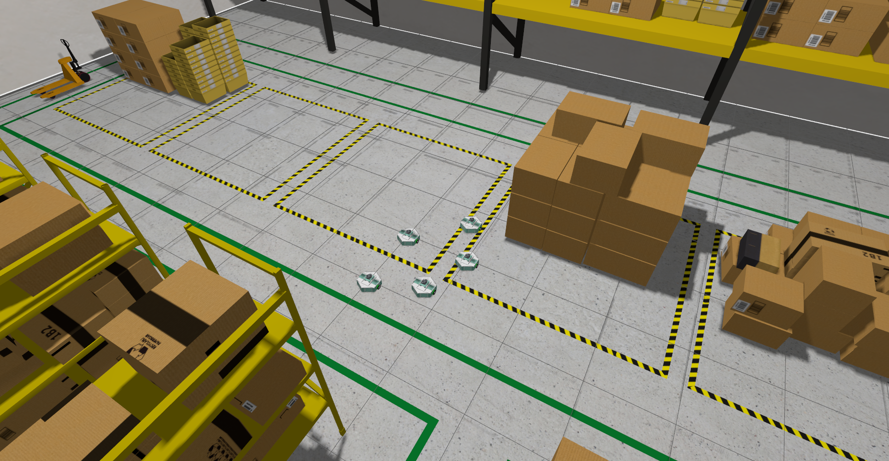

Ce guide explique comment utiliser plusieurs robots MiniPock dans une même simulation.

:::info

La gestion de plusieurs robots est possible grâce à l'utilisation de namespaces. Les namespaces permettent de séparer les topics, services et paramètres de chaque robot. Elle est disponible (pour le moment) uniquement en simulation

:::

L'utilisation de plusieurs robots au sein d'une même simulation reprends la logique des différents guides précedents: l'[**installation**](Installation.md), le [**démarrage rapide**](Démarrage-rapide.md), la [**navigation**](Navigation.md) et la [**simulation**](Simulation.md).

Cependant les configurations changent et des fichiers de lancement adaptés sont à utiliser pour la simuation et la navigation.

## [Simulation](Simulation.md)

Cette version permet de créer et afficher le nombre souhaité de minipocks.

```shell
ros2 launch minipock_gz spawn_multiple.launch.py use_sim_time:=true opt_param_1:=my_param
```

Les paramètres optionnels:

- **use_sim_time** (bool): Pour utiliser le temps de la simulation par défaut
- **nb_robots** (int): Nombre de robots souhaités. Par défaut ***1***.
- **robot_name** (string): Nom commun à tous les robots, un suffixe sera ajouté incrémentalement. *(exemple: minipock0, minipock1, minipock2, etc.)*. Par défaut ***minipock***.
- **world** (string): Nom du monde. Par défaut ***minipock_world***.

**Pour une utiisation couplée avec la navigation, mettre *use_sim_time* à *true***



## Téléopération

```bash
ros2 run minipock_teleop teleop_keyboard --ros-args -p namespace:=robot_namespace/
```

-> *En cas de mauvais namespace demandé la liste des namespaces existants sera donnée*
-> *Dans le cas où le topic cmd_vel demandé n'existerait pas, la liste des topics cmd_vel existants sera donnée*

## [Navigation](Navigation.md)

Il est possible de **lancer navigation et localisation en forçant le démarrage** grâce à:

```bash
ros2 launch minipock_navigation2 navigation2_multiple.launch.py bringup:=false use_sim_time:=true autostart:=true nb_robots:=nb_robots robot_name:=robot_name
```

Les paramètres optionnels:

- **nb_robots** (int): Nombre de robots souhaités. Par défaut ***1***.
- **robot_name** (string): Nom commun à tous les robots, un suffixe sera ajouté incrémentalement. *(exemple: minipock0, minipock1, minipock2, etc.)*. Par défaut ***minipock***.
- **start_rviz** (bool): Démarrage automatique de rviz. Par défaut ***true***.
- **use_sim_time** (bool): Pour utiliser le temps de la simulation (**recommandé**). Par défaut ***false*** .
- **bringup** (bool): Démarrage du bringup de minipock. Par défaut ***true***.
- **autostart** (bool): Démarrage automatique des éléments de navigation. Par défaut ***false***.
- **use_composition** (bool): Les nodes sont lancés dans des containers afin d'optimiser la mémoire et les ressources CPU utilisées. Par défaut ***true***.
- **use_respawn** (bool): Relance les nodes qui plantent. À utiliser si la composition est désactivée. Par défaut: ***false***.

Une fenêtre rviz se lancera automatiquement sans nécessité de startup manuel.

___

## Projet d'entraînement Turtlebot3

### Avec 2 turtlebots burger

- Sources :
  - [Online Course from The Construct](https://app.theconstruct.ai/open-classes/ca4e2636-c3e1-4b14-8149-da1a193fcb0e/)
  - [Vidéo liée au Cours](https://www.youtube.com/watch?v=cGUueuIAFgw&t=1703s)

Le Rosject est disponible au téléchargement à la création d'un compte sur le site [The Construct](https://app.theconstruct.ai/).

Ce cours ne détaille que les changements inhérents à la localisation des turtlebots. Le reste ayant été fait en amont pour simplifier le tutoriel.

Pour plus de clareté, lire le document de cours.

#### Lancement de la simulation

Afin de lancer la simulation :

```bash
ros2 launch turtlebot3_gazebo turtlebot3_tc_world_two_robots.launch.py
```

Les commandes pour déplacer les robots par clavier sont:

```bash
ros2 run teleop_twist_keyboard teleop_twist_keyboard --ros-args --remap cmd_vel:=/tb3_0/cmd_vel
```

```bash
ros2 run teleop_twist_keyboard teleop_twist_keyboard --ros-args --remap cmd_vel:=/tb3_1/cmd_vel
```

#### Configuration de la localisation multi-robot

Les étapes décrites par le cours ont été suivies et consistent à isoler les robots dans des *namespaces*.

Ce *rosject* permet d'avoir une première vision d'une séparation simple de la localisation des robots en gardant un point d'accroche commun: **la carte**.

Dans ce cours, la bibliothèque utilisée pour fournir une localisation et navigation automatisée est celle de [Nav2](https://docs.nav2.org/).

Les modules de Nav2 sont lancés un par un par des fichiers personnalisés.

Cet exemple d'application de la navigation à du multi-robot n'est pas automatisé et conduit à la copie de nombreux fichiers si l'on veut changer ou ajouter des robots.

### 1 burger et 1 waffle

Afin d'adapter la simulation pour afficher deux robots différents, c'est-à-dire un turtlebot burger et un turtlebot waffle, la description de chaque robot était fournie.

En fournissant aux *nodes* *robot_state_publisher* les différentes descriptions, on génère alors les robots souhaités.
On peut alors adapté le *namespace* selon le type du robot et cela fonctionnera de la même manière que précedemment.

### Avec 3 robots

Basé sur le code fourni pour [2 robots](#avec-2-robots) le défi est d'en ajouter 1 autre pour mieux s'approprier le code.

- Pour placer deux *burger* et un *waffle* par exemple, il suffit de créé un nouveau *node robot_state_publisher* qui prendra en compte une autre description adaptée avec le bon *namespace*.
- Le fichier de monde doit aussi être modifié pour ajouter un robot et ses coordonnées.
- Dans le fichier de lancement il est aussi nécessaire d'ajouter un *node AMCL* en plus ainsi que la configuration adaptée en associant le bon *namespace*.

___

## Minipock

:::info

[Contrôle de robots multiples](https://github.com/catie-aq/minipock/pull/15)

:::

### Architecture globale


### Simulation Multi Robots

Afin d'obtenir des robots différents sur une même simulation il faut d'abord avoir des **robots visuellement séparés**, avec **chacun leurs composants et leur propre origine de spawn**.

### Isolation Visuelle

#### Adaptation de la description du robot

Il faut commencer par **changer la manière de décrire un robot**. Le *namespace* isole les contextes des robots en leur permettant de garder les mêmes noms de composants, *topics*, services, etc.


**Pour ce projet le "/" entre le namespace et les noms des entités sera inclut par défaut à des endroits clés afin de permettre qu'un *namespace vide* utilisé dans la description marche.**

Nous allons détailler les différents points importants en partant du **fichier de description principal ci-dessous**.

Extrait du fichier principal de description([minipock_v2.urdf.xacro](https://github.com/catie-aq/minipock/blob/2a5dde2bdabffc274674ef64b8ad0e4328c02b80/minipock_description/urdf/minipock_v2.urdf.xacro))

- *Le namespace est ajouté dans les arguments globales du fichiers et celui-ci pourra être transmis depuis l'extérieur.*

```xml
<robot name="minipock" xmlns:xacro="http://ros.org/wiki/xacro">
  <xacro:arg name="namespace" default="minipock/"/>
  <xacro:property name="namespace" value="$(arg namespace)"/>
</robot>
```

Ce namespace doit être **propagé aux différents fichiers de description**, cela sera montré dans les **extraits servant d'exemple ci-après**:
- Appel du fichier de description *motor_stepper* dans le fichier principal ([minipock_v2.urdf.xacro](https://github.com/catie-aq/minipock/blob/2a5dde2bdabffc274674ef64b8ad0e4328c02b80/minipock_description/urdf/minipock_v2.urdf.xacro)):

    ```xml
    <xacro:motor_stepper namespace="${namespace}" name="stepper_left"
                        x="0.0" y="0.133" z="-0.086" R="0.0" P="0.0"
                        Y="0.0" side="1"/>
    ```

* Utilisation dans le fichier des moteurs ([motor_stepper_v2.xacro](https://github.com/catie-aq/minipock/blob/2a5dde2bdabffc274674ef64b8ad0e4328c02b80/minipock_description/urdf/motor_stepper_v2.xacro)):

  ```xml
    <robot name="minipock" xmlns:xacro="http://ros.org/wiki/xacro">
        <xacro:macro name="motor_stepper"
            params="namespace:=minipock/ name:=stepper_left x:=0.0 y:=0.0 z:=0.0
                            R:=0.0 P:=0.0 Y:=0.0 side:=1">
            <link name="${namespace}${name}_base_link">
            [...]
            </link>
            <joint name="${name}_joint" type="fixed">
                <parent link="${namespace}base_link" />
                <child link="${namespace}${name}_base_link" />
                <origin xyz="${x} ${y} ${z}" rpy="${R} ${P} ${Y}" />
            </joint>
        </xacro:macro>
    </robot>
    ```

> Pour compléter l'isolation des robots,  il était nécessaire d'**ajouter une *coordinate frame*** nommée ***base_footprint*** au dessus de ***base_link***:
>
> La **convention de nommage** est d'ajouter ce lien au-dessus de *base_link*.
> *Base_link* a son origine là où le robot est **initialisé** souvent au centre du robot ou au point de pivot.
> *Base_footprint* représente l'origine projetée sous le robot dans le monde.
  ([Documentation sur les *coordinates frames*](https://automaticaddison.com/coordinate-frames-and-transforms-for-ros-based-mobile-robots/))

```xml
<xacro:macro name="minipock_base" params="namespace:=minipock name:=minipock">

    <link name="${namespace}base_footprint">
    </link>
    <joint name="base_joint" type="fixed">
        <origin xyz="${x} ${y} ${z}" rpy="0 0 0"/>
        <parent link="${namespace}base_footprint"/>
        <child link="${namespace}base_link"/>
    </joint>
</xacro:macro>
```

#### Transmission du namespace

Pour transmettre le namespace il faut s'assurer dans le module *model_v2.py* que le namespace soit bien transmis.
Dans ce module qui génère le fichier sdf à partir de l'urdf on a:

```python
xacro_command = ["xacro", urdf, f"namespace:={ROBOT_NAME}/"]
```

#### Point de spawn

D'après la documentation du package **ros_gz_sim** et plus précisement de l'éxécutable *create* ([exemple d'utilisation](https://gazebosim.org/docs/harmonic/migrating_gazebo_classic_ros2_packages#spawn-model)), il est possible de préciser le point de spawn du modèle.

Ce paramètre est rajouté dans [les arguments à retourner au *Node Create*](https://github.com/catie-aq/minipock/blob/33cf1da845582200fdd0e30b94e6fdd0f74b3609/minipock_description/minipock_description/model_v2.py#L84-L107)

Le *Node Create* sera donc créé autant de fois que de robots demandés dans la simulation

### Logique ROS2

#### Adaptation des bridges

La manière de créer les ***bridges*** doit être adaptée, [la fonction crée une liste de *bridges* à effectuer et les *nodes* associés](https://github.com/catie-aq/minipock/blob/33cf1da845582200fdd0e30b94e6fdd0f74b3609/minipock_gz/launch/spawn_multiple.launch.py#L181-L216). On ajoute d'abord les *bridges* communs, ici les messages de *clock*. **Puis pour chaque robot on associe les *topics* à un *namespace***:

- Extrait de la fonction *bridge* dans [*spawn_multiple.launch.py*](https://github.com/catie-aq/minipock/blob/33cf1da845582200fdd0e30b94e6fdd0f74b3609/minipock_gz/launch/spawn_multiple.launch.py):

    ```python
    bridges_list = [
            bridges.clock(),
        ]
        for robot in robots:
            bridges_list.extend([
                bridges.pose(model_name=robot['name']),
                bridges.joint_states(model_name=robot['name'], world_name=world_name),
                bridges.odometry(model_name=robot['name']),
                bridges.cmd_vel(model_name=robot['name']),
                bridges.scan_lidar(model_name=robot['name']),
                bridges.tf(model_name=robot['name']),
        ])
    ```

Il faut aussi adapter la classe qui s'occupe des *bridges* en vérifiant la correspondance entre les *paths* de cette classe et ceux générés par gazebo avec :

```bash
gz topic -l
```

Par exemple le ***gz_topic tf*** doit avoir le *path* suivant puisque c'est celui **créé par Gazebo**:

```python
def tf(model_name):
    return bridge.Bridge(
        gz_topic=f"/model/{model_name}/tf",
        ros_topic=f"/tf",
        gz_type="gz.msgs.Pose_V",
        ros_type="tf2_msgs/msg/TFMessage",
        direction=bridge.BridgeDirection.GZ_TO_ROS,
    )
```

#### Paramètres du plugin diff-drive-system

Grâce à la [documention du plugin diff-drive-system](https://gazebosim.org/api/sim/8/classgz_1_1sim_1_1systems_1_1DiffDrive.html) les paramètres ont pû être adaptés.

Il faut ajouter les *namespaces* devant les *topics* pour lesquels le [plugin](https://github.com/catie-aq/minipock/blob/33cf1da845582200fdd0e30b94e6fdd0f74b3609/minipock_description/urdf/minipock_v2.urdf.xacro#L26-L39) doit lire ou écrire des données dans le [fichier de description](https://github.com/catie-aq/minipock/blob/33cf1da845582200fdd0e30b94e6fdd0f74b3609/minipock_description/urdf/minipock_v2.urdf.xacro).

```xml
<plugin
    filename="gz-sim-diff-drive-system"
    name="gz::sim::systems::DiffDrive">
    <left_joint>stepper_left_wheel_joint</left_joint>
    <right_joint>stepper_right_wheel_joint</right_joint>
    <wheel_separation>0.335</wheel_separation>
    <wheel_radius>0.036</wheel_radius>
    <odom_publish_frequency>50</odom_publish_frequency>

    <topic>${namespace}cmd_vel</topic>
    <odom_topic>${namespace}odom</odom_topic>
    <child_frame_id>${namespace}base_footprint</child_frame_id>
    <frame_id>${namespace}odom</frame_id>
</plugin>
```

#### Données du lidar

Les données du lidar transitent par divers *nodes*. [L'un d'eux](https://github.com/catie-aq/minipock/blob/09435b17507b52b29ae9f65fc20cb2c501f1b210/minipock_gz/minipock_gz/lidar_process_multiple.py) a pour but de **récupérer les données dans le topic */scan_raw* et les transférer dans */scan***. Un ***namespace* a donc été appliqué** à chacun de ces *topics* ainsi que dans le *header* du message transmis.

#### Launchfile de spawn

À cette étape plusieurs robots peuvent être créés, il s'agit donc d'**automatiser** le fichier de *launch* pour adapter les services au nombre de robots demandés.

Les données sont stockées dans une liste initialisée avec le nombre de robots souhaités pour créer des noms incrémentaux et des positions générées en spirale autour de l'origine du monde.

**Lancement de la simulation multi-robots:**

```shell
ros2 launch minipock_gz spawn_multiple.launch.py use_sim_time:=true opt_param_1:=my_param
```

Les paramètres optionnels:

- **use_sim_time** (bool): Pour utiliser le temps de la simulation par défaut
- **nb_robots** (int): Nombre de robots souhaités. Par défaut ***1***.
- **robot_name** (string): Nom commun à tous les robots, un suffixe sera ajouté incrémentalement. *(exemple: minipock0, minipock1, minipock2, etc.)*. Par défaut ***minipock***.
- **world** (string): Nom du monde. Par défaut ***minipock_world***.

**Pour une utiisation couplée avec la navigation, mettre *use_sim_time* à *true***


#### Teleop

Afin de contrôler les différents robots présents en simulation, il était possible d'utiliser la fonction *remap*:

- Exemple avec le namespace *minipock0*:

    ```bash
    ros2 run minipock_teleop teleop_keyboard --ros-args --
    remap cmd_vel:=/minipock0/cmd_vel
    ```

Mais pour simplifier ce choix du *namespace* (et donc du robot), cette feature a été implémenté dans la classe [TeleopController](https://github.com/catie-aq/minipock/blob/33cf1da845582200fdd0e30b94e6fdd0f74b3609/minipock_navigation/minipock_teleop/minipock_teleop/teleop_keyboard.py#L68-L79).

**Il faut donc utiliser:**

```bash
ros2 run minipock_teleop teleop_keyboard --ros-args -p namespace:=robot_namespace/
```

-> *En cas de mauvais namespace demandé la liste des namespaces existants sera donnée*
-> *Dans le cas où le topic cmd_vel demandé n'existerait pas, la liste des topics cmd_vel existants sera donnée*

## Navigation Multi-Robots

### Problématique de Nav2

Dans la première version où un seul *minipock* était concerné, les modules de navigation et localisation étaient tous lancés par le [fichier de *bring up*](https://github.com/ros-navigation/navigation2/blob/12a9c1d805847709e3b82f8dcfbb43c67b5b2937/nav2_bringup/launch/bringup_launch.py) fourni par [*Nav2*](https://docs.nav2.org/index.html).

Lors de la transition vers le lancement de la navigation pour plusieurs robots, l'automatisation fournie dans la bibliothèque a eu ses limites.

En effet, le *bring up Nav2* permet bien d'attribuer et isoler la navigation/localisation pour chaque robot, mais n'est pas, à notre connaissance, permissif sur le partage de certaines ressources.

Afin de partager la carte par exemple, il est **nécessaire de ne pas intégrer le serveur de la carte dans le namespace d'un robot**.
De plus, leur isolation permet également de séparer le *topic /tf* et */tf_static* que nous voulions garder communs.

### Configuration des modules de navigation et localisation

La configuration des modules de navigation et de localisation est réalisée dans un fichier *yaml*.
Les changements concernent les noms des *topics* utilisés par les différents modules.

Afin de pouvoir changer pour chaque robot le *namespace* associé, un mot clé est utilisé et sera réécrit: ***\<robot_namespace\>***.

Il en va de même pour changer la valeur permettant d'utiliser le temps de la simulation ou non, le mot clé ***\<use_sim_time\>*** sera remplacé par *true* ou *false*.

Exemple des changements à effectuer pour l'[*AMCL*](https://github.com/catie-aq/minipock/blob/09435b17507b52b29ae9f65fc20cb2c501f1b210/minipock_navigation/minipock_navigation2/param/minipock_multi.yaml#L1-L42) par [rapport aux précédentes configurations:](https://github.com/catie-aq/minipock/blob/d594d1f84faa8a4c3e4839c3e5541078dba00a61/minipock_navigation/minipock_navigation2/param/minipock_multi.yaml#L1-L42)

On obtient alors des transformées qui sont reliées par la même carte:


### Lancement des modules de navigation et localisation

Au sein du fichier de lancement, les différentes configurations précedemment détaillées sont utilisées. Les différents noms des robots sont stockés et parcourus afin de lancer séparément les modules de navigation et localisation propre à chaque machine.

> Seuls le serveur de la carte et le *lifecycle manager node* sont lancés indépendamment puisque la finalité est de partager la carte entre les robots.

>Actuellement les informations des robots sont à changer directement dans le fichier.

Il est possible de **lancer navigation et localisation en forçant le démarrage des *nodes*** grâce à:

```bash
ros2 launch minipock_navigation2 navigation2_multiple.launch.py bringup:=false use_sim_time:=true autostart:=true nb_robots:=nb_robots robot_name:=robot_name
```

Les paramètres optionnels:

- **nb_robots** (int): Nombre de robots souhaités. Par défaut ***1***.
- **robot_name** (string): Nom commun à tous les robots, un suffixe sera ajouté incrémentalement. *(exemple: minipock0, minipock1, minipock2, etc.)*. Par défaut ***minipock***.
- **start_rviz** (bool): Démarrage automatique de rviz. Par défaut ***true***.
- **use_sim_time** (bool): Pour utiliser le temps de la simulation (**recommandé**). Par défaut ***false*** .
- **bringup** (bool): Démarrage du bringup de minipock. Par défaut ***true***.
- **autostart** (bool): Démarrage automatique des éléments de navigation. Par défaut ***false***.
- **use_composition** (bool): Les nodes sont lancés dans des containers afin d'optimiser la mémoire et les ressources CPU utilisées. Par défaut ***true***.
- **use_respawn** (bool): Relance les nodes qui plantent. À utiliser si la composition est désactivée. Par défaut: ***false***.
