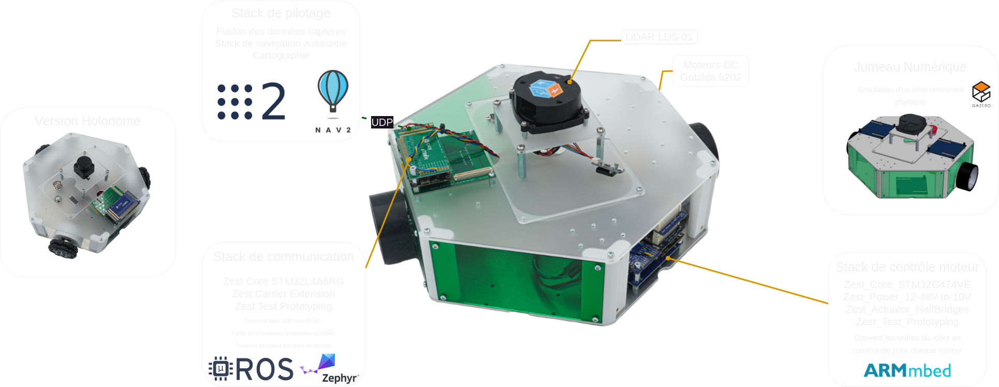

La plateforme MiniPock est une plateforme robotique modulaire. Le support de ROS2 ainsi que la compatibilité avec la plateforme 6TRON permettent de développer des applications plus rapidement.

## Spécifications

|                                 | Différentiel         | Holonome |
| ------------------------------- | -------------------- | -------- |
| Vitesse de translation maximale | 2 m/s (15V)          |          |
| Vitesse de rotation maximale    | 12 rad/s (15V)       |          |
| Dimension (L x l x h)           | 33.5 x 33.5 x 8 cm   |          |
| Poids                           | 3.850 kg             |          |
| Batterie                        | 4S                   |          |
| Connecteur extension            | Connecteur 6TRON x 2 |          |

La base différentiel prévoit l’emplacement pour 2 stack 6TRON (full size) dont l’une est réservée au contrôle moteur.

