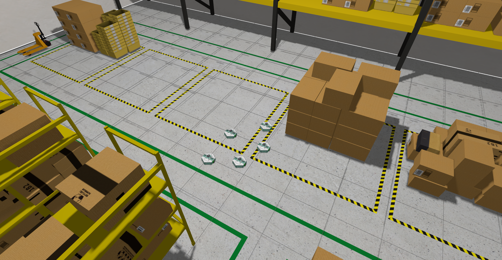

[Contrôle de robots multiples](https://github.com/catie-aq/minipock/pull/15)

# Turtlebot3
## Simulation de Navigation Multi-robots dans ROS2
### Avec 2 robots

#### 2 turtlebots burger

- Sources :
  - [Online Course from The Construct](https://app.theconstruct.ai/open-classes/ca4e2636-c3e1-4b14-8149-da1a193fcb0e/)
  - [Vidéo liée au Cours](https://www.youtube.com/watch?v=cGUueuIAFgw&t=1703s)

Le Rosject est disponible au téléchargement à la création d'un compte sur le site [The Construct](https://app.theconstruct.ai/).

Ce cours ne détaille que les changements inhérents à la localisation des turtlebots. Le reste ayant été fait en amont pour simplifier le tuto.

Pour plus de clareté, lire le document de cours.
Précision du début du tuto:
> In this unit, the simulation is properly set up with two TurtleBot3 robots, one named tb3_0 and the other tb3_1

##### Configurations globales

Un conteneur Docker a été utilisé avec les configurations suivantes (basé sur celui du Minipock):

- devcontainer.json :

    ```json
    {
    "dockerFile": "Dockerfile",
    "build": {
    "target": "base"
    },
    "containerEnv": {
    "DISPLAY": "${localEnv:DISPLAY}"
    },
    "runArgs": [
    "--network=host",
    "--privileged"
    ],
    "mounts": [
    "source=/tmp/.X11-unix,target=/tmp/.X11-unix,type=bind",
    "source=/dev/dri,target=/dev/dri,type=bind",
    "source=/dev/shm,target=/dev/shm,type=bind"
    ],
    "features": {
    "ghcr.io/devcontainers-contrib/features/pipx-package:1": {},
    "ghcr.io/devcontainers-contrib/features/pre-commit:2": {}
    },
    "customizations": {
    "bash": "source /opt/ros/humble/setup.bash && source install/setup.bash",
    "zsh": "source /opt/ros/humble/setup.zsh && source install/setup.zsh"
    },
    "postStartCommand": "/bin/bash -c 'source /opt/ros/humble/setup.bash && colcon build'",
    "postCreateCommand": "echo 'source /opt/ros/humble/setup.bash' >> ~/.bashrc && echo 'source install/setup.bash' >> ~/.bashrc && echo 'source /usr/share/gazebo/setup.bash' >> ~/.bashrc && echo 'source ~/.bashrc' && echo 'export GAZEBO_MODEL_PATH=$GAZEBO_MODEL_PATH:/workspaces/ros-developers-open-class/install/turtlebot3_gazebo/share/turtlebot3_gazebo/models' >> ~/.bashrc"
    }
    ```

- Dockerfile :

    ```Dockerfile
    FROM osrf/ros:humble-desktop-jammy as base

    RUN apt-get update && apt-get install -y \
        python3-pip \
        python3-colcon-common-extensions

    RUN sudo apt-get -y install ros-humble-xacro
    RUN sudo apt-get -y install ros-humble-navigation2
    RUN sudo apt-get -y install ros-humble-rqt-tf-tree

    RUN sudo apt-get -y install ros-humble-gazebo-ros-pkgs

    RUN rm -rf /var/lib/apt/lists/*
    ```

**Ne pas oublier de sourcer si cel ne marche pas correctement.**

##### Lancement de la siùulation

Afin de lancer la simulation :

```bash
ros2 launch turtlebot3_gazebo turtlebot3_tc_world_two_robots.launch.py
```

Les commandes pour déplacer les robots par clavier sont:

```bash
ros2 run teleop_twist_keyboard teleop_twist_keyboard --ros-args --remap cmd_vel:=/tb3_0/cmd_vel
```

```bash
ros2 run teleop_twist_keyboard teleop_twist_keyboard --ros-args --remap cmd_vel:=/tb3_1/cmd_vel
```

##### Configuration de la localisation multi-robot

Les étapes décrites par le cours ont été suivies mais certaines modifications ont dues être apportées.

Sous **ros2_ws > src > localization_server > launch** :

- multi_localization.launch.py :

  ```python
    import os

    from ament_index_python.packages import get_package_share_directory
    from launch import LaunchDescription
    from launch_ros.actions import Node

    def generate_launch_description():

        tb3_0_config = os.path.join(get_package_share_directory(
            'localization_server'), 'config', 'tb3_0_amcl_config.yaml')
        tb3_1_config = os.path.join(get_package_share_directory(
            'localization_server'), 'config', 'tb3_1_amcl_config.yaml')
        map_file = os.path.join(get_package_share_directory(
            'map_server'), 'config', 'turtlebot_area.yaml')

        return LaunchDescription([
            Node(
                package='nav2_map_server',
                executable='map_server',
                name='map_server',
                output='screen',
                parameters=[{'use_sim_time': True},
                            {'topic_name': 'map'},
                            {'frame_id': 'map'},
                            {'yaml_filename': map_file}]
            ),

            Node(
                namespace='tb3_0',
                package='nav2_amcl',
                executable='amcl',
                name='amcl',
                output='screen',
                parameters=[tb3_0_config]
            ),

            Node(
                namespace='tb3_1',
                package='nav2_amcl',
                executable='amcl',
                name='amcl',
                output='screen',
                parameters=[tb3_1_config]
            ),

            Node(
                package='nav2_lifecycle_manager',
                executable='lifecycle_manager',
                name='lifecycle_manager_localization',
                output='screen',
                parameters=[{'use_sim_time': True},
                            {'autostart': True},
                            {'bond_timeout':0.0}, # This is to make sure that the nodes are not waiting for the bond to be formed, prevent errors
                            {'node_names': ['map_server', 'tb3_0/amcl', 'tb3_1/amcl']}]
            )
        ])
  ```

Sous **ros2_ws > src > localization_server > config** :

- tb3_0_amcl_config.yaml :

```python
tb3_0/amcl:
  ros__parameters:
    use_sim_time: True
    alpha1: 0.2
    alpha2: 0.2
    alpha3: 0.2
    alpha4: 0.2
    alpha5: 0.2
    base_frame_id: "tb3_0/base_footprint" # added namespace
    beam_skip_distance: 0.5
    beam_skip_error_threshold: 0.9
    beam_skip_threshold: 0.3
    do_beamskip: false
    global_frame_id: "map"
    lambda_short: 0.1
    laser_likelihood_max_dist: 2.0
    laser_max_range: 100.0
    laser_min_range: -1.0
    laser_model_type: "likelihood_field"
    max_beams: 60
    max_particles: 8000
    min_particles: 200
    odom_frame_id: "tb3_0/odom" # added namespace
    pf_err: 0.05
    pf_z: 0.99
    recovery_alpha_fast: 0.0
    recovery_alpha_slow: 0.0
    resample_interval: 1
    robot_model_type: "nav2_amcl::DifferentialMotionModel"
    save_pose_rate: 0.5
    sigma_hit: 0.2
    tf_broadcast: true
    transform_tolerance: 1.0
    update_min_a: 0.2
    update_min_d: 0.25
    z_hit: 0.5
    z_max: 0.05
    z_rand: 0.5
    z_short: 0.05
    scan_topic: "scan" # no namespace because it is automatically added --> scan_topic: "tb3_0/scan"
    map_topic: "/map" # topic is global, "/" is added to not append namespace automatically --> map_topic: "/map"

    # ACTIVATE THE set_initial_pose WHEN YOU HAVE A PROPER initial_pose, by uncommenting the code below
    #set_initial_pose: true
    #initial_pose:
    # x: 7.778
    # y: -9.589
    # z: 0.0
    # a: -0.211

tb3_0/amcl_map_client:
  ros__parameters:
    use_sim_time: True

tb3_0/amcl_rclcpp_node:
  ros__parameters:
    use_sim_time: True
```

> **Éditer le code précédent pour adapter à *tb3_1***
> Si une erreur sur le modèle du robot apparaît, tester de remplacer les **robot_model_type "differential"** par **robot_model_type "nav2_amcl::DifferentialMotionModel"**

Pour lancer la multi localisation:

```bash
ros2 launch localization_server multi_localization.launch.py
```

Lancer aussi:

```bash
rviz2
```

> **IMPORTANT: avoir la simulation et la localisation d'ouvertes pour faire le paramétrage dans rviz2.**

Pour visualiser les différents composants et debugger:

```bash
ros2 run rqt_tf_tree rqt_tf_tree
```

#### Un burger et un waffle

Afin d'adapter la simulation pour afficher un turtlebot burger et un turtlebot waffle des configurations ont été modifiées.

Sous **ros2_ws/src/tb3_multirobot_ros2/tb3_sim/turtlebot3_simulations/turtlebot3_gazebo/launch** :

- création d'une copie de *turtlebot3_tc_world_two_robots.launch.py* :

  ```python

    def generate_launch_description():
        [...]
        world_file_name = 'turtlebot3_tc_two_robots_diff.world'
        [...]
        burger_robot_desc_path = os.path.join(get_package_share_directory("turtlebot3_description"), "urdf", "turtlebot3_burger.urdf")
        waffle_robot_desc_path = os.path.join(get_package_share_directory("turtlebot3_description"), "urdf", "turtlebot3_waffle.urdf")

        [...]

            Node(
                package='robot_state_publisher',
                executable='robot_state_publisher',
                name='robot_state_publisher',
                namespace=entity_name_0,
                parameters=[{'frame_prefix': entity_name_0+'/', 'use_sim_time': use_sim_time, 'robot_description': Command(['xacro ', burger_robot_desc_path, ' robot_name:=', entity_name_0])}],
                output="screen"
            ),

            Node(
                package='robot_state_publisher',
                executable='robot_state_publisher',
                name='robot_state_publisher',
                namespace=entity_name_1,
                parameters=[{'frame_prefix': entity_name_1+'/', 'use_sim_time': use_sim_time, 'robot_description': Command(['xacro ', waffle_robot_desc_path, ' robot_name:=', entity_name_1])}],
                output="screen"
            )

        [...]

  ```

Sous **ros2_ws/src/tb3_multirobot_ros2/tb3_sim/turtlebot3_simulations/turtlebot3_gazebo/models** :

- Duplication du dossier turtlebot3_waffle en turtlebot3_waffle_1, opérer tous les changements nécessaires dans **model.sdf** pour que tb3_1 soit écrit aux mêmes endroit que le **model.sdf** de **turtlebot3_burger_1**.
- Duplication du fichier **turtlebot3_tc_two_robots.world** et changement de l'uri **model://turtlebot3_burger_1** en **model://turtlebot3_waffle_1**.

### Avec 3 robots

Basé sur le code fourni pour [2 robots](#avec-2-robots) le défi est d'en ajouter 1 autre pour mieux s'approprier le code.

- Pour placer deux *burger* et un *waffle* il suffit de copier le dossier préceddemment créé mais cette fois avec pour nom **turtlebot3_waffle_2**, en opérant les changements internes nécessaires.
- Le fichier de monde doit aussi être dupliqué et changé en ajoutant un robot et ses coordonées:

```xml
<pose>0 -1.2 0.01 0.0 0.0 0.0</pose>
```

- Le fichier *launch* sera dupliqué et changé en ajoutant les Nodes nécessaires et les liens vers les bonnes desscriptions de robots.
- Dans le package de localisation, il est nécessaire de créer un nouveau launch qui lance un Node de plus et qui est relié au fichier de config **tb3_2_amcl_config.yaml** qui est à créer

# Minipock
## Simulation Multi Robots

Afin d'obtenir des robots différents sur une même simulation il faut d'abord avoir des **robots visuellement séparés**, avec **chacun leurs composants et leur propre origine de spawn**.

### Séparation Visuel
#### Adaptation de la description du robot

Il faut commencer par **changer la manière de décrire un robot**. Le *namespace* isole les contextes des robots en leur permettant de garder les mêmes noms de composants, *topics*, services, etc. **Pour ce projet le "/" entre le namespace et les noms des entités sera inclut dans par défaut afin de permettre qu'un *namespace vide* utilisé dans la description marche.**
Nous allons détailler les différents points importants en partant du **fichier de description principal ci-dessous**.

Extrait du fichier principal de description(*minipock_v2.urdf.xacro*)
- *Le namespace est ajouté dans les arguments globales du fichiers et celui-ci pourra être transmis depuis l'extérieur.*
```xml
<robot name="minipock" xmlns:xacro="http://ros.org/wiki/xacro">
  <xacro:arg name="namespace" default="minipock/"/>
  <xacro:property name="namespace" value="$(arg namespace)"/>
</robot>
```

Ce namespace doit être **propagé aux différents fichiers de description**, cela sera montré dans les **extraits servant d'exemple ci-après**:
* L'appel du fichier de description *motor_stepper* dans le fichier principal (*minipock_v2.urdf.xacro*):
    ```xml
    <xacro:motor_stepper namespace="${namespace}" name="stepper_left"
                        x="0.0" y="0.133" z="-0.086" R="0.0" P="0.0"
                        Y="0.0" side="1"/>
    ```
* L'utilisation dans le fichier des moteurs (*motor_stepper_v2.xacro*), exemple d'intégration (*base_link est créé dans un autre fichier*)
  ```xml
    <robot name="minipock" xmlns:xacro="http://ros.org/wiki/xacro">
        <xacro:macro name="motor_stepper"
            params="namespace:=minipock/ name:=stepper_left x:=0.0 y:=0.0 z:=0.0
                            R:=0.0 P:=0.0 Y:=0.0 side:=1">
            <link name="${namespace}${name}_base_link">
            [...]
            </link>
            <joint name="${name}_joint" type="fixed">
                <parent link="${namespace}base_link" />
                <child link="${namespace}${name}_base_link" />
                <origin xyz="${x} ${y} ${z}" rpy="${R} ${P} ${Y}" />
            </joint>
        </xacro:macro>
    </robot>
    ```

* L'ajout d'un *cordinate frame* nommée *base_footprint* au dessus de *base_link*:
  La convention de nommage est d'ajouter ce lien au-dessus de *base_link*. *Base_link* a son origine là où le robot est initialisé souvent au centre du robot ou au point de pivot.
  *Base_footprint* représente l'origine projetée sous le robot dans le monde.
  ([Documentation sur les *coordinates frames*](https://automaticaddison.com/coordinate-frames-and-transforms-for-ros-based-mobile-robots/))

  ```xml
    <xacro:macro name="minipock_base" params="namespace:=minipock name:=minipock">

        <link name="${namespace}base_footprint">
        </link>
        <joint name="base_joint" type="fixed">
            <origin xyz="${x} ${y} ${z}" rpy="0 0 0"/>
            <parent link="${namespace}base_footprint"/>
            <child link="${namespace}base_link"/>
        </joint>
    </xacro:macro>
    ```

#### Transmission du namespace

Pour transmettre le namespace il faut s'assurer dans le module *model_v2.py* que le namespace soit bien transmis.
Dans ce module qui génère le fichier sdf à partir de l'urdf on a:

```python
    xacro_command = ["xacro", urdf, f"namespace:={ROBOT_NAME}/"]
```

#### Point de spawn

D'après la documentation du package **ros_gz_sim** et plus précisement de l'éxécutable *create* ([exemple d'utilisation](https://gazebosim.org/docs/harmonic/migrating_gazebo_classic_ros2_packages#spawn-model)), il est possible de préciser le point de spawn du modèle.

Ce paramètre est rajouté dans les arguments à retourner au *Node Create*, ici dans le module *model.py*:

```python
def spawn_args(robot_name=ROBOT_NAME, robot_position_str):
    """
    Return the spawning arguments for the create command

    :return: list of arguments
    """
    global ROBOT_NAME
    ROBOT_NAME = robot_name
    x, y, z = robot_position_str.split(" ")
    model_sdf = generate()
    return ["-string", model_sdf, "-name", ROBOT_NAME, "-allow_renaming", "false", "-x", x, "-y", y, "-z", z]
```
Le *Node Create* sera donc créé autant de fois que de robots demandés dans la simulation

### Logique ROS2

#### Adaptation des bridges

La manière de créer les bridges doit être adaptée, la fonction crée une liste de *bridges* à effectuer. On ajoute d'abord les *bridges* communs, ici les messages de *clock*. Puis pour chaque robot on *bridge* avec leur *namespace* tous les *topics*:
- Extrait de la fonction *bridge* dans *spawn_multiple.launch.py*:
    ```python
    bridges_list = [
            bridges.clock(),
        ]
        for robot in robots:
            bridges_list.extend([
                bridges.pose(model_name=robot['name']),
                bridges.joint_states(model_name=robot['name'], world_name=world_name),
                bridges.odometry(model_name=robot['name']),
                bridges.cmd_vel(model_name=robot['name']),
                bridges.scan_lidar(model_name=robot['name']),
                bridges.tf(model_name=robot['name']),
        ])
    ```

Il faut aussi adapter la classe qui s'occupe des bridges en vérifiant la correspondance entre les paths de cette classe et ceux générés par gazebo avec :

```bash
gz topic -l
```
Par exemple le *gz_topic **tf*** doit avoir le *path* suivant puisque c'est celui créé par Gazebo:
```python
def tf(model_name):
    return bridge.Bridge(
        gz_topic=f"/model/{model_name}/tf",
        ros_topic=f"/tf",
        gz_type="gz.msgs.Pose_V",
        ros_type="tf2_msgs/msg/TFMessage",
        direction=bridge.BridgeDirection.GZ_TO_ROS,
    )
```

#### Paramètres du plugin diff-drive-system
Grâce à la [documention du plugin diff-drive-system](https://gazebosim.org/api/sim/8/classgz_1_1sim_1_1systems_1_1DiffDrive.html) les paramètres ont pû être adaptés.

Il faut ajouter les *namespaces* devant les *topics* pour lesquels le plugin doit lire ou écrire des données.

```xml
<plugin
    filename="gz-sim-diff-drive-system"
    name="gz::sim::systems::DiffDrive">
    <left_joint>stepper_left_wheel_joint</left_joint>
    <right_joint>stepper_right_wheel_joint</right_joint>
    <wheel_separation>0.335</wheel_separation>
    <wheel_radius>0.036</wheel_radius>
    <odom_publish_frequency>50</odom_publish_frequency>

    <topic>${namespace}cmd_vel</topic>
    <odom_topic>${namespace}odom</odom_topic>
    <child_frame_id>${namespace}base_footprint</child_frame_id>
    <frame_id>${namespace}odom</frame_id>
</plugin>
```
#### Launchfile de spawn

À cette étape plusieurs robot speuvent être créés, il s'agit donc d'automatiser le fichier de *launch* pour adapter les services au nombre de robots demandés.

Cela est réalisé au travers d'une liste de robots initialisées avec le nombre de robots souhaités et dont les positions sont actuellement générées en spirale.

Lancement de la simulation multi-robots:
```shell
ros2 launch minipock_gz spawn_multiple.launch.py opt_param_1:=my_param
```
Les paramètres optionnels:
- **nb_robots** (int): Nombre de robots souhaités. Par défaut ***1***.
- **robot_name** (string): Nom commun à tous les robots, un suffixe sera ajouté incrémentalement. *(exemple: minipock0, minipock1, minipock2, etc.)*. Par défaut ***minipock***.
- **world** (string): Nom du monde. Par défaut ***minipock_world***.



#### Teleop

Afin de contrôler les différents robots présents en simulation, il était possible d'utiliser la fonction *remap*:
* Exemple avec le namespace *minipock0*:
    ```bash
    ros2 run minipock_teleop teleop_keyboard --ros-args --
    remap cmd_vel:=/minipock0/cmd_vel
    ```

Mais pour simplifier ce choix du *namespace* (*et donc du robot*), cette feature a été implémenté dans la classe [TeleopController](https://github.com/catie-aq/minipock/blob/33cf1da845582200fdd0e30b94e6fdd0f74b3609/minipock_navigation/minipock_teleop/minipock_teleop/teleop_keyboard.py#L68-L79)

```bash
ros2 run minipock_teleop teleop_keyboard --ros-args -p namespace:=robot_namespace/
```
-> *En cas de mauvais namespace demandé la liste des namespaces existants sera donnée*
-> *Dans le cas où le topic cmd_vel demandé n'existerait pas, la liste des topics cmd_vel existants sera donnée*