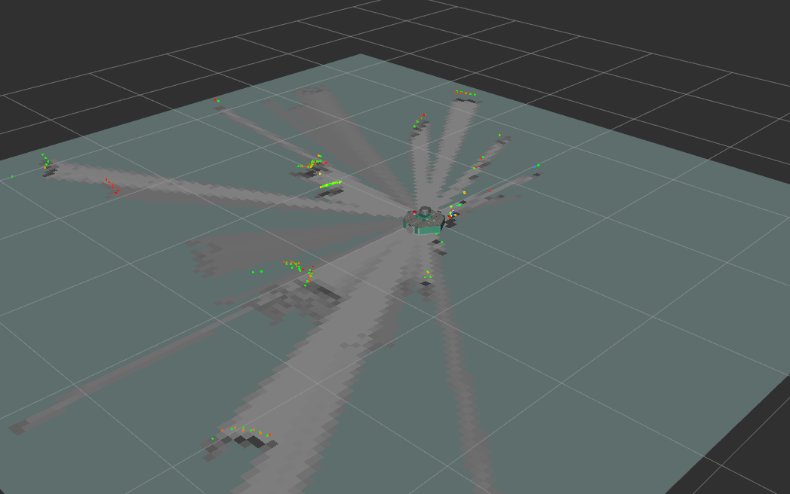
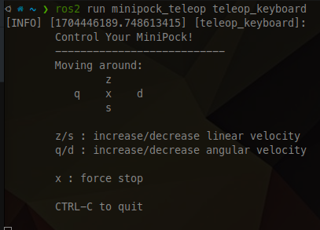

Le SLAM (Simultaneous Localization and Mapping) est une technique permettant de dessiner une carte en estimant la position actuelle dans un espace arbitraire.

## Lancement du SLAM

Assurez vous d’être sur le même `ROS_DOMAIN_ID` que le MiniPock (par défaut `10`)

Lancez le bringup du MiniPock

```shell
ros2 launch minipock_bringup bringup.launch.py
```

Lancez ensuite le SLAM en utilisant `cartographer`

```shell
ros2 launch minipock_cartographer cartographer.launch.py
```



## Lancement de la téléopération

import Tabs from '@theme/Tabs';
import TabItem from '@theme/TabItem';

<Tabs>
<TabItem value="standalone" label="Robot Unique" default>

```shell
ros2 run minipock_teleop teleop_keyboard
```

</TabItem>

<TabItem value="multiple" label="Plusieurs robots">

```shell
ros2 run minipock_teleop teleop_keyboard --ros-args -p namespace:=robot_namespace/
```

</TabItem>

</Tabs>



## Sauvegarde de la carte

La carte est dessinée sur la base de l'odométrie du robot, des informations de tf et de scan. Ces données cartographiques sont dessinées dans la fenêtre RViz au fur et à mesure que le MiniPock se déplace. Après avoir créé une carte complète de la zone souhaitée, il est nécessaire de sauvegarder les données.

Lancez le nœud map_saver_cli dans le paquet nav2_map_server pour créer des fichiers de carte.
Le fichier de carte est enregistré dans le répertoire où le nœud map_saver_cli a été lancé.
À moins qu'un nom de fichier spécifique ne soit fourni, map sera utilisé comme nom de fichier par défaut et créera map.pgm et map.yaml.

```shell
ros2 run nav2_map_server map_saver_cli -f ~/map
```

L'option `-f` spécifie l'emplacement du dossier et le nom du fichier dans lequel les fichiers doivent être enregistrés.

Avec la commande ci-dessus, map.pgm et map.yaml seront enregistrés dans le dossier personnel.
