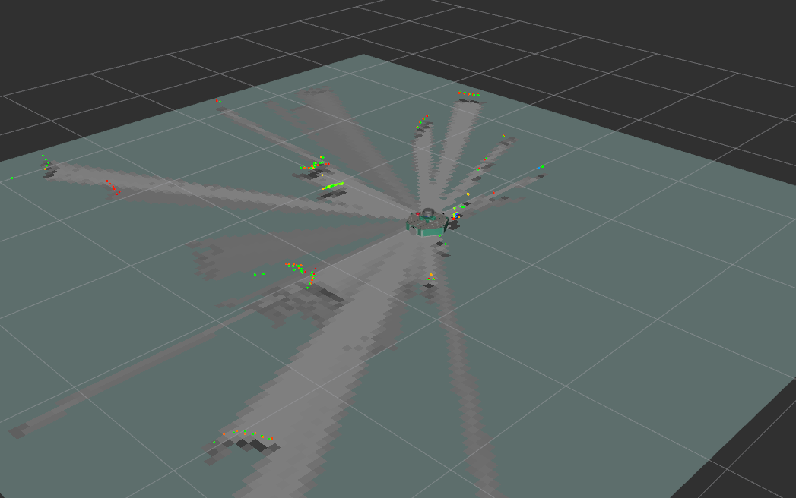

Le SLAM (Simultaneous Localization and Mapping) est une technique permettant de dessiner une carte en estimant la position actuelle dans un espace arbitraire.

## Lancement du SLAM

Lancez le bringup du MiniPock (nécessaire pour la communication avec le robot réel)

```shell
ros2 launch minipock_bringup bringup.launch.py
```

Lancez ensuite le SLAM en utilisant `cartographer`

```shell
ros2 launch minipock_cartographer cartographer.launch.py
```



Lancez ensuite le noeud de téléopération pour contrôler le robot et cartographier la zone

```shell
ros2 run minipock_teleop minipock_teleop
```

## Sauvegarde de la carte

La carte est dessinée sur la base de l'odométrie du robot, des informations de tf et de scan. Ces données cartographiques sont dessinées dans la fenêtre RViz au fur et à mesure que le MiniPock se déplace. Après avoir créé une carte complète de la zone souhaitée, il est nécessaire de sauvegarder les données.

Lancez le nœud `map_saver_cli` dans le paquet `nav2_map_server` pour créer des fichiers de carte.
Le fichier de carte est enregistré dans le répertoire où le nœud `map_saver_cli` a été lancé.
À moins qu'un nom de fichier spécifique ne soit fourni, map sera utilisé comme nom de fichier par défaut et créera `map.pgm` et `map.yaml`.

```shell
ros2 run nav2_map_server map_saver_cli -f ~/map
```

L'option `-f` spécifie l'emplacement du dossier et le nom du fichier dans lequel les fichiers doivent être enregistrés.

Avec la commande ci-dessus, map.pgm et map.yaml seront enregistrés dans le dossier personnel.

## API Documentation

### Noeuds

- `/cartographer_node`: Ce noeud est responsable de la construction de la carte du robot MiniPock.
- `/cartographer_occupancy_grid_node`: Ce noeud est responsable de la publication de la carte de probabilité d'occupation.
- `rviz2` : Visualisation de la carte en temps réel.
- `odom_relay` : Relais de l'odométrie de `minipock_0/odom` à `odom` voir [documentation](https://google-cartographer-ros.readthedocs.io/en/latest/configuration.html)
- `scan_relay` : Relais des scans de `minipock_0/scan` à `scan` voir [documentation](https://google-cartographer-ros.readthedocs.io/en/latest/configuration.html)

### Topics

Publiés par `cartographer_node`:

- `/submap_list`: Ce topic diffuse la liste des submaps.
- `/trajectory_node_list`: Ce topic publie la liste des trajectoires.
- `/tf`: Le topic `/tf` publie les transformations entre les différents repères coordonnés dans le robot.
- `/contraint_list`: Ce topic publie les contraintes entre les différentes trajectoires.
- `/landmark_poses_list`: Ce topic publie les poses des landmarks.
- `/scan_matched_points2`: Ce topic publie les points de scan correspondants.

Publiés par `cartographer_occupancy_grid_node`:

- `/map`: Ce topic publie la carte de probabilité d'occupation.

Soucrit par `cartographer_node`:

- `/scan`: Ce topic reçoit les scans du lidar.
- `/odom`: Ce topic reçoit l'odométrie du robot.
