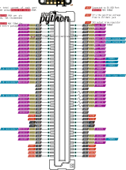
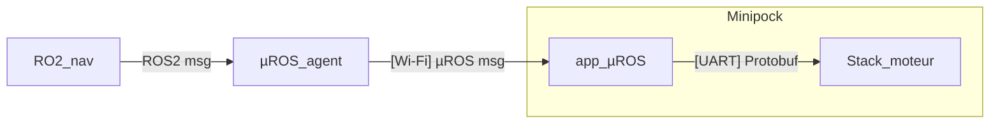
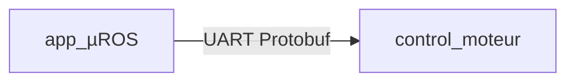

## Aperçu

Le système embarqué MiniPock est composé de deux parties :
- La stack applicative qui gère la navigation et communique avec la stack de controle moteur. Elle intègre micro-ROS pour la communication avec les nœuds ROS2 et est basée sur Zephyr OS.
- La stack de controle moteur permet déplacer le robot. Elle intègre le RBDC (Robot Base Driver Control) qui permet de demander un déplacement en x, y, theta.

## Architecture


## Stack applicative

La stack applicative est basée sur les cartes 6TRON suivantes :
- [Zest_Core_STM32H753ZI](https://6tron.io/zest_core/zest_core_stm32h753zi_2_0_0)
- [Zest_Test_Prototyping](https://6tron.io/zest/zest_test_prototyping_1_0_0)
- [Zest_Radio_WiFi](https://6tron.io/zest/zest_radio_wifi_1_0_0)

### Pinout


### Software

Dépôt : [minipock](https://github.com/catie-aq/minipock_zephyr-demo)
Pour l'installation, voir [ici](2-Installation.md#installation-minipock-).

La liste des topics et des noeuds est disponible [ici](4-Bringup.md###Topics).

### LiDAR

Référence : LD19
Le LiDAR est connecté à la stack applicative via une interface UART.

| LiDAR | Stack moteur |
| ----- | ------------ |
| TX    | P1_DIO12     |
| PWM   | P1_PWM1      |

## Stack moteur

Cartes 6TRON :
- [Zest_Carrier_Extension](https://6tron.io/zest/zest_carrier_extension_1_0_0)
- [Zest_Core_STM32G474VET](https://6tron.io/zest/zest_core_stm32g474vet_1_0_0)
- [Zest_Actuator_HalfBridges](https://6tron.io/zest/zest_actuator_halfbridges_1_0_0)
- [Zest_Test_Prototyping](https://6tron.io/zest/zest_test_prototyping_1_0_0)

### Pinout



## Software

Dépôt : [minipock](https://github.com/catie-aq/minipock_mbed-rbdc).

Pour l'installation, voir [ici](2-Installation.md#installation-stack-contrôle-moteurs).

## Interface



### Communication Stack applicative - Stack moteur

La stack applicative communique avec la stack moteur via une interface UART. 



### Pinout

| Stack moteur | 6TRON      |
| ------------ | ---------- |
| P1_UART_TX   | P1_UART_RX |
| P1_UART_RX   | P1_UART_TX |

### Protocole de communication

Le protocol de communication est basé sur des messages protocol buffer.

```protobuf
syntax = "proto3";

message cmd_vel {
  float linear_x = 1;
  float linear_y = 2;
  float linear_z = 3;
  float angular_x = 4;
  float angular_y = 5;
  float angular_z = 6;
}

message odom {
  float x = 1;
  float y = 2;
  float theta = 3;
}
```
