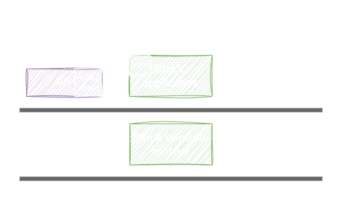
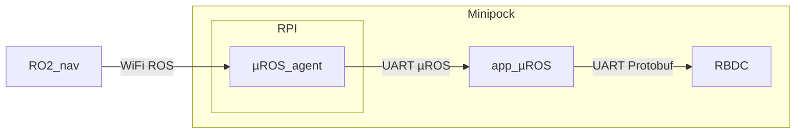
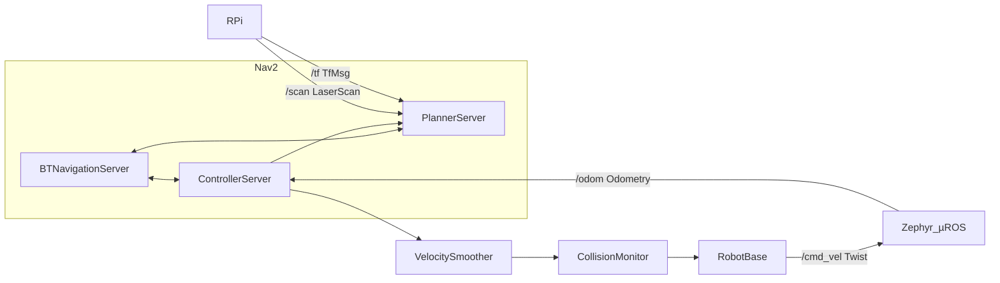

## Architecture {#7e03927da8fc45818ec435f2b3b69272}



## Interface {#cf465c6ecfe1442ca910367aada66ae0}

- La communication entre les nœuds ROS2 et la stack applicative utilise les topics ROS.
- La communication entre la stack applicative et le RBDC utilise les messages protobuf.



## Communication µROS - ROS2 {#3a7cbeeb6d0d4894808da1fd514ed1cb}



### Liste des topics {#4ccd31d432fc4e44a7702ece040880b1}

| Topic    | Type     |
| -------- | -------- |
| /cmd_vel | Twist    |
| /odom    | odometry |

### Communication micro-ROS ↔RBDC | Protocol Buffer {#fb6e5ec426084f5bae3dbbebe04b5d5c}

```protobuf
syntax = "proto3";

message cmd_vel {
  float linear_x = 1;
  float linear_y = 2;
  float linear_z = 3;
  float angular_x = 4;
  float angular_y = 5;
  float angular_z = 6;
}

message odom {
  float x = 1;
  float y = 2;
  float theta = 3;
}
```
