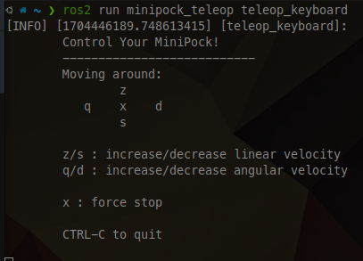

Le SLAM (Simultaneous Localization and Mapping) est une technique permettant de dessiner une carte en estimant la position actuelle dans un espace arbitraire.

## Lancement du SLAM {#e7a5c8609f8743da8f042bee1ba5444a}

Assurez vous d’être sur le même `ROS_DOMAIN_ID` que le MiniPock (par défaut `10`)

Lancez le bringup du MiniPock

```shell
ros2 launch minipock_bringup bringup.launch.py
```

Lancez ensuite le SLAM en utilisant `cartographer`

```shell
ros2 launch minipock_cartographer cartographer.launch.py
```


## Lancement de la téléopération {#ef9c9ef603684c6c9fe4e889951ae5ac}

```shell
ros2 run minipock_teleop teleop_keyboard
```



## Sauvegarde de la carte {#2c258d3ec9744687958db9cbb2cf7c3c}

La carte est dessinée sur la base de l'odométrie du robot, des informations de tf et de scan. Ces données cartographiques sont dessinées dans la fenêtre RViz au fur et à mesure que le MiniPock se déplace. Après avoir créé une carte complète de la zone souhaitée, il est nécessaire de sauvegarder les données.

Lancez le nœud map_saver_cli dans le paquet nav2_map_server pour créer des fichiers de carte.
Le fichier de carte est enregistré dans le répertoire où le nœud map_saver_cli a été lancé.
À moins qu'un nom de fichier spécifique ne soit fourni, map sera utilisé comme nom de fichier par défaut et créera map.pgm et map.yaml.

```shell
ros2 run nav2_map_server map_saver_cli -f ~/map
```

L'option -f spécifie l'emplacement du dossier et le nom du fichier dans lequel les fichiers doivent être enregistrés.
Avec la commande ci-dessus, map.pgm et map.yaml seront enregistrés dans le dossier personnel ~/(/home/${username}).
