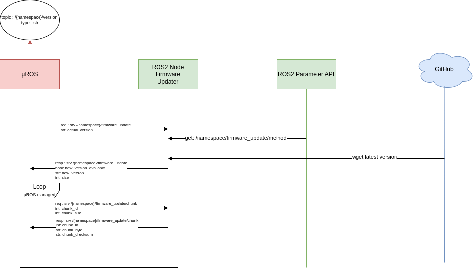

## Mise à jour du système embarqué

Les mises à jour sont disponibles dans les realeases du projet [MiniPock](https://github.com/catie-aq/minipock_zephyr-demo/releases).

### Lancer une mise à jour

Le système vérifie au demarrage si une mise à jour est disponible. Si c'est le cas, la mise à jour est téléchargée et installée automatiquement.

Lancer une mise à jour manuellement :
```
firmware update
```

Afficher la version du firmware :
```
firmware version
```

###  Protocol de mise à jour


