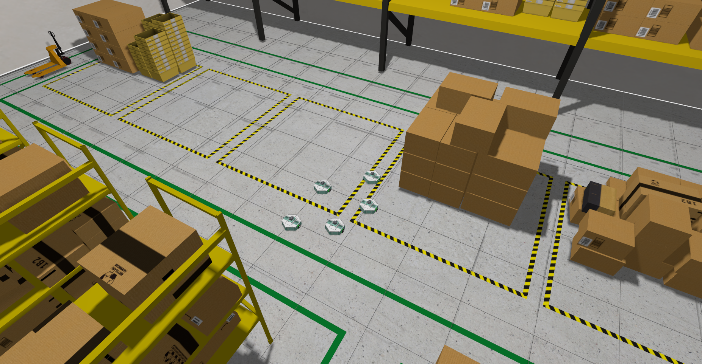

Pour utiliser MiniPock dans un environnement simulé il est nécessaire d’avoir installé [Gz Sim Harmonic](https://gazebosim.org/docs/harmonic/install).

:::warning

Pour lancer la simulation, assurez-vous d'avoir installé [`gz-harmonic`](https://gazebosim.org/docs/harmonic/install_ubuntu) ou de lancer le container Docker avec l'image taggé simulation.

:::

## Lancer la simulation

:::info
Le [fichier de configuration de la flotte de minipock](https://github.com/catie-aq/minipock/blob/d142d3694b96a446592f0b822c336ed1964f9d7f/minipock/minipocks.yaml) doit être complété pour donner des informations pratiques aux différents composants comme la simulation ou la navigation.
:::

```shell
ros2 launch minipock_gz spawn.launch.py opt_param_1:=my_param
```

Les paramètres optionnels:

- **paused** (bool): Pour démarrer la simulation en pause.
- **world** (string): Nom du monde. Par défaut ***minipock_world***.



Vous pouvez ensuite lancer les autres stacks (téléopération, SLAM, navigation) pour utiliser le MiniPock.
