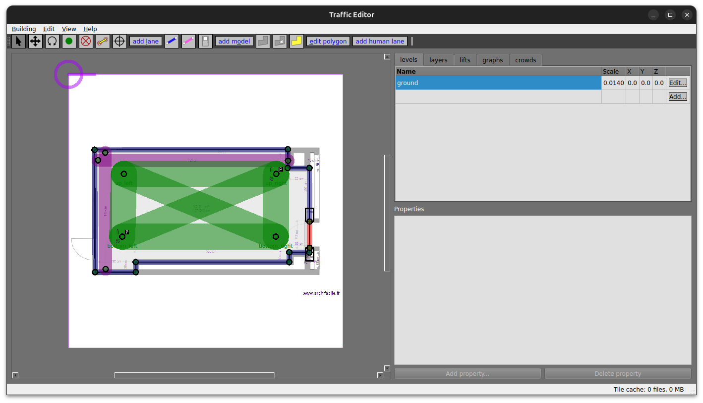
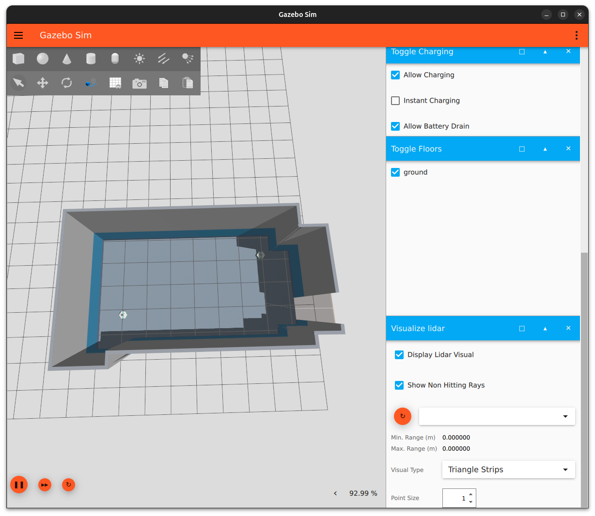
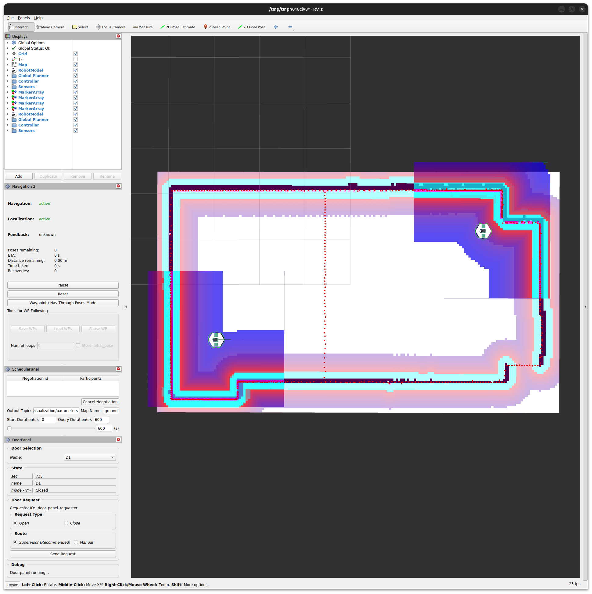
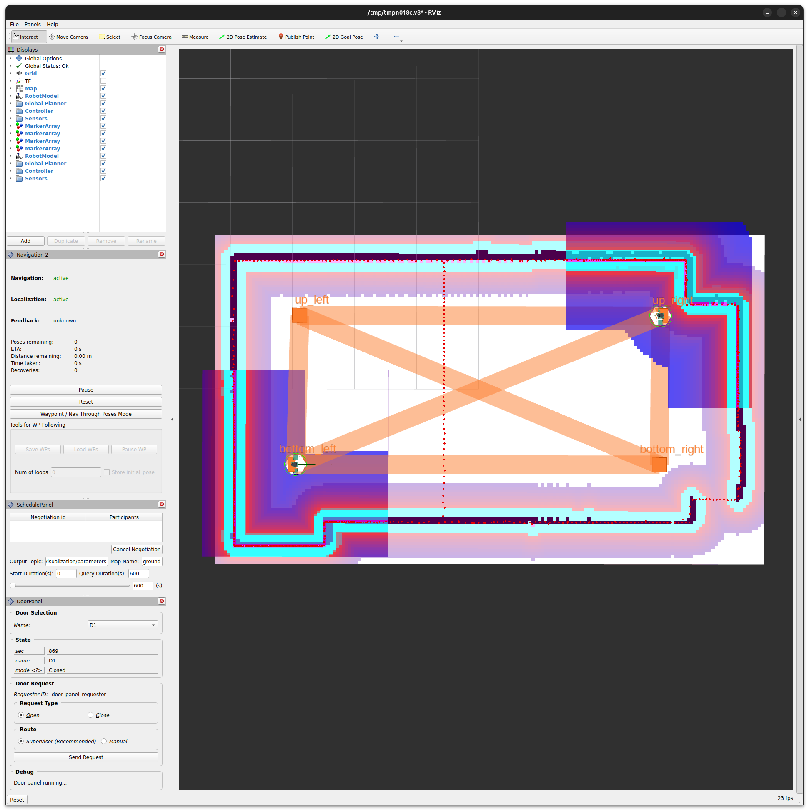
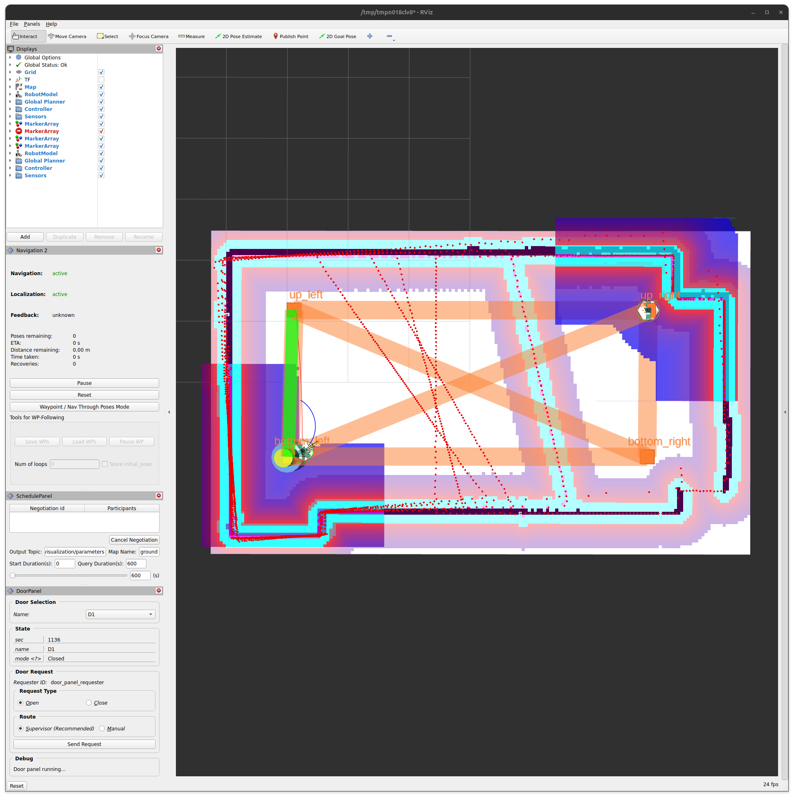
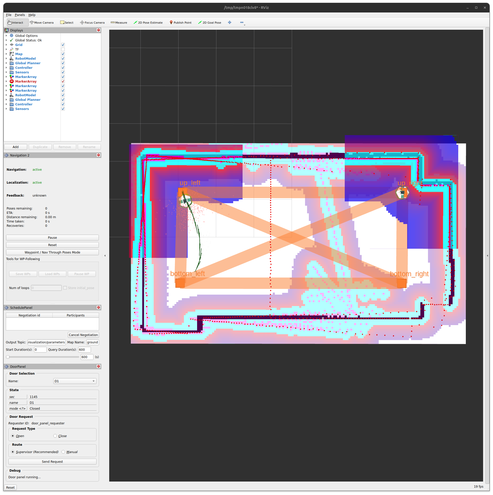

## Open-RMF

Le Robot Middleware Framework Open Source (Open-RMF), est basé sur ROS2 et essaye de gérer et simplifier les systèmes multi-robots hétérogènes.

Il est conçu pour répondre à des problématiques de répartition de tâches entre robots en gérant les espaces, les trajectoires et les potentiels conflits. Les robots peuvent alors avoir des provenances différentes sans que l'utilisateur soit impacté et restreint dans ses choix.

Le challenge étant de rester suffisamment générique pour gérer différent scénarios, différentes infrastructures, sur des temporalités variables, tout en étant flexible sur l'intégration de nouveaux modèles ou applications.

Le cas d'utilisation imaginé encadre des lieux vastes tels que des centres commerciaux, des universités, des hôtels, ou encore des hôpitaux, qui ont besoin de diriger plusieurs flottes de robots pour le nettoyage, la livraison ou encore la patrouille. Ces lieux ont donc probablement des infrastructures à gérer comme des portes, des ascenseurs ou encore des distributeurs.

Pour une description plus détaillée, veuillez consulter le [livret](https://osrf.github.io/ros2multirobotbook/intro.html) ainsi que le README de [open-rmf](https://github.com/open-rmf/rmf), de leur [démos](https://github.com/open-rmf/rmf_demos) ainsi que de tout autre composants de ce framework.

## Prise en main Open-RMF

En se basant sur [les packages de démos](https://github.com/open-rmf/rmf_demos/tree/main) fournis par Open-RMF et grâce à de la [documentation](https://osrf.github.io/ros2multirobotbook/intro.html), le plus accessible était la construction d'une carte.
Le deuxième défi était d'avoir un minipock en simulation qui puisse réagir à une mission de patrouille prédéfinie par Open-RMF.

L'environnement choisi se compose de **ros2 Jazzy** et de **gazebo Harmonic** afin d'avoir moins de problèmes de compatibilité et un développement à jour.

:::info
Pour télécharger les composants de Open-RMF:

```bash
sudo apt update && sudo apt install ros-jazzy-rmf-dev
```

Puis rendre  les librairies accessibles:

```bash
export GZ_SIM_SYSTEM_PLUGIN_PATH=$GZ_SIM_SYSTEM_PLUGIN_PATH:/opt/ros/jazzy/lib/rmf_robot_sim_gz_plugins:/opt/ros/jazzy/lib/rmf_building_sim_gz_plugins
export GZ_GUI_PLUGIN_PATH=$GZ_GUI_PLUGIN_PATH:/opt/ros/jazzy/lib/rmf_robot_sim_gz_plugins:/opt/ros/jazzy/lib/rmf_building_sim_gz_plugins
source ~/.bashrc
```

:::

### Construction d'une carte

La création d'une nouvelle carte est assez simple grâce à l'interface graphique proposée. Son utilisation est expliquée dans ce [guide](https://osrf.github.io/ros2multirobotbook/traffic-editor.html).

Cette éditeur permet de créer, entre autre, des "sommets" ou *vertices*. Ce sont des points identifiés et nommables, qui peuvent posséder des attributs tels "zone de chargement", "zone de stationnement", etc, et donc d'être le point par défaut d'un robot.

Afin d'ajouter un robot sur un *vertex* il est sûrement nécessaire de l'ajouter à la main dans le fichier en .building.yaml créé au niveau du vertex souhaité (prendre exemple sur la [map demos office](https://github.com/open-rmf/rmf_demos/blob/main/rmf_demos_maps/maps/office/office.building.yaml)). Il est d'ailleurs parfois plus rapide de compléter certaines propriétés des *vertices* à la main dans le fichier, l'interface ne nous laisse les ajouter qu'une par une par fenêtre interposée.

L'option *crowd_sim* permettant d'ajouter des personnes qui peuvent se déplacer n'a pas été testée.

A partir d'un plan quelconque, il est possible de créer une pièce. En se basant sur une image il est possible de construire des murs, des sols, des étages, etc. Le plus intéressant étant de construire des lignes de déplacement que les robots pourront ensuite emprunter. Aucune documentation sur le bouton "zone de mission" n'a été trouvée.
<div style="text-align: center;">  </div>

Une fois la carte éditée, les *building map tools* peuvent être utilisés pour créer des fichiers de navigation, un fichier *world* pour gazebo et les dossiers des modèles nécessaires à la génération du monde.
Pour ces différentes fonctionnalités, les instructions sont fournies dans le [README du dépôt traffic editor](https://github.com/open-rmf/rmf_traffic_editor).

:::warning

Le monde .world généré par *building map tools* **ne contient pas les plugins nécessaires au bon fonctionnement du lidar**. Il convient d'**adapter le fichier** pour garantir un **fonctionnement optimal de la navigation**.

:::

### Fichiers de configuration

Les fichiers de configuration utiles sont:

- **La configuration de la flotte**: Description des spécificités des robots couvrant par exemple, la taille de leur empreinte, la capacité de leur batterie, les tâches réalisables, les noms des robots et bien d'autres paramètres.
- **La configuration rviz**: Avec la gestion des plugins *rmf*, ce qui permet de visualiser les tâches.
  
:::note
Actuellement, les fichiers de configuration nécessaires au fonctionnement de *rmf* sont inspirés de ceux du [dépôt de rmf demos](https://github.com/open-rmf/rmf_demos/tree/main). *Ils pourraient à terme faire l'objet d'une refonte pour ne pas faire doublon avec les fichiers de configurations déjà fournis par minipock.*
:::

### Lancement d'une démo simulation + navigation + RMF

Le lancement d'une [simulation](Simulation.md) et de la stack de [navigation](Navigation.md) reste presque inchangé, il suffit juste de changer le nom du monde dans les paramètres de la simulation, par exemple:

```bash
ros2 launch minipock_gz spawn.launch.py world:=empty_room_world
```



Il faut aussi changer le nom de la map et du fichier rviz si besoin.Il est nécessaire d'adapter le fichier de configuration de minipock pour donner les coordonnées des *vertices* sur lesquels ils se trouvent.



Le lancement de la partie *rmf* se fait comme suit:

```bash
source ~/.bashrc
ros2 launch minipock_fleet_adapter empty_room.launch.xml server_uri:="ws://localhost:8000/_internal"
```

si pas de nudged:

```bash
sudo apt-get install python3-pip
pip install nudged
```

<div style="text-align: center;">  </div>

:::info
Un seul robot est préconfiguré dans rviz, il faut rajouter les autres à la main
:::

Lancement d'une [tâche de patrouille](https://github.com/open-rmf/rmf_demos/blob/main/rmf_demos_tasks/rmf_demos_tasks/dispatch_patrol.py) basée sur les [demos rmf](https://github.com/open-rmf/rmf_demos/tree/main):

```bash
source ~/.bashrc
ros2 run minipock_fleet_adapter dispatch_patrol -p up_left --use_sim_time
```





### Tâche custom

suivre [tuto pour savoir comment ajouter nouvelle tâche](https://osrf.github.io/ros2multirobotbook/task_new.html) => pour avoir une tâche "custom" qui est faites avec les briques déjà prévues.

:::info
**Discussion autour des tâches:**

Actuellement elles sont très restreintes et ne permettent pas beaucoup de liberté, ils sont en train d'implémenter de quoi créer des tâches via des graphes, avec GUI etc:
<https://github.com/open-rmf/rmf/discussions/169>

Présentation de leurs objectifs/technos/etc:
<https://docs.google.com/presentation/d/1XE4A_72Y0qLHpkoXuEI4dEKK3Jf0zM7cgX1yj1XTEJg/edit#slide=id.g2d18c1126ba_0_190>
:::

## Quelques détails

:::info

- *"Currently we assume each robot in the map has a dedicated charging location as annotated with the is_charger option in the traffic editor map"*

- Pas de stack de navigation complète intégrée à *rmf* actuellement, trop complexe à faire tourner sinon pour la simulation​

:::
