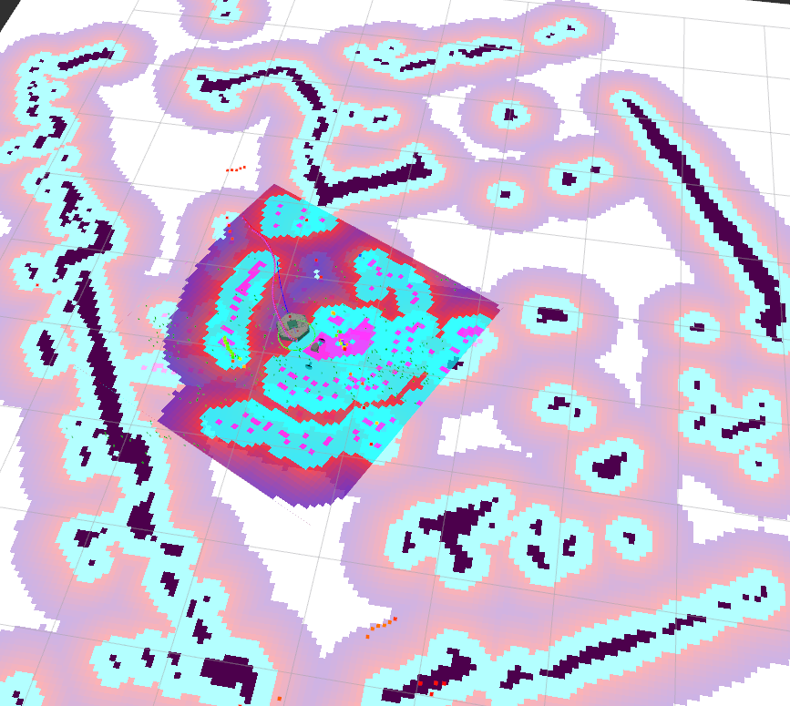

La navigation consiste à déplacer le robot d'un endroit à la destination spécifiée dans un environnement donné. Pour ce faire, une carte contenant des informations géométriques sur les meubles, les objets et les murs de l'environnement donné est nécessaire. Comme décrit dans la section SLAM précédente, la carte a été créée avec les informations de distance obtenues par le capteur et les informations de pose du robot lui-même.

La navigation permet à un robot de se déplacer de la position actuelle à la position cible désignée sur la carte en utilisant la carte, l'encodeur du robot, le capteur IMU et le capteur de distance. La procédure d'exécution de cette tâche est la suivante.

## Lancement de la navigation

```shell
ros2 launch minipock_navigation2 navigation2.launch.py
```

:::info

Les informations sur le nombre de robots, leurs types, le lancement du bringup sont contenus dans le fichier de configuration `minipock/minipocks.yaml`

:::

La `map` utilisée est le fichier `map.yaml` dans `minipock_navigation2/map/map.yaml`

## Estimer la position initiale

- Cliquez sur le bouton 2D Pose Estimate dans le menu RViz2.
- Cliquez sur la carte où se trouve le robot et faites glisser la flèche verte vers la direction à laquelle le robot fait face.

## Donner un ordre de navigation

- Cliquez sur le bouton Navigation2 Goal dans le menu RViz2.
- Cliquez sur la carte pour définir la destination du robot et faites glisser la flèche verte vers la direction vers laquelle le robot sera orienté.
  - Cette flèche verte est un marqueur qui permet de spécifier la destination du robot.
  - La racine de la flèche correspond aux coordonnées x, y de la destination, et l'angle θ est déterminé par l'orientation de la flèche.
  - Dès que x, y, θ sont définis, TurtleBot3 commence immédiatement à se déplacer vers la destination.



## Paramétrage

Les paramètres de navigation sont paramétrables dans le fichier [`minipock.yaml`](https://github.com/catie-aq/minipock_navigation/blob/main/minipock_navigation2/param/minipock.yaml).
