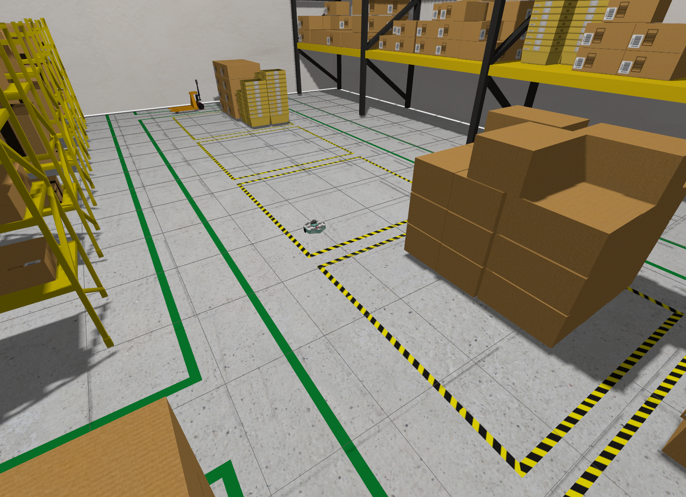

Pour utiliser MiniPock dans un environnement simulé il est nécessaire d’avoir installé [Gz Sim Garden](https://gazebosim.org/docs/garden/install).

:::warning

Pour lancer la simulation, assurez-vous d'avoir installé [`gz-garden`](https://gazebosim.org/docs/garden/install_ubuntu) ou de lancer le container Docker avec `target=simulation`.

:::

import Tabs from '@theme/Tabs';
import TabItem from '@theme/TabItem';

## Lancer la simulation

Assurez vous d’être sur le même `ROS_DOMAIN_ID` que le MiniPock (par défaut `10`)

<Tabs>
<TabItem value="smmple robot" label="Version simple robot" default>

### Robot unique

Lancez ensuite la simulation

```shell
ros2 launch minipock_gz spawn.launch.py
```



Vous pouvez ensuite lancer les autres stacks (téléopération, SLAM, navigation) pour utiliser le MiniPock.

</TabItem>

<TabItem value="multi robot" label="Version supportant le multi-robots">

### Multi-robots

Cette version permet de créer et afficher le nombre souhaité de minipocks.

```shell
ros2 launch minipock_gz spawn_multiple.launch.py use_sim_time:=true opt_param_1:=my_param
```

Les paramètres optionnels:

- **use_sim_time** (bool): Pour utiliser le temps de la simulation par défaut
- **nb_robots** (int): Nombre de robots souhaités. Par défaut ***1***.
- **robot_name** (string): Nom commun à tous les robots, un suffixe sera ajouté incrémentalement. *(exemple: minipock0, minipock1, minipock2, etc.)*. Par défaut ***minipock***.
- **world** (string): Nom du monde. Par défaut ***minipock_world***.

**Pour une utiisation couplée avec la navigation, mettre *use_sim_time* à *true***


</TabItem>

</Tabs>

---

Ensemble de ressources permettant de configurer l'environnement de simulation Gazebo ainsi que les plugins ROS
nécessaires dans le cadre du projet MiniPock.
Ce package configure par ailleurs les différents bridges nécessaires pour la communication entre ROS 2 Humble et Gazebo
Sim .

## Description du monde {#96512d89e5af4ac98755fe94ec6afed4}

Le monde est défini en se basant sur [https://app.gazebosim.org/OpenRobotics/fuel/worlds/industrial-warehouse](https://app.gazebosim.org/OpenRobotics/fuel/worlds/industrial-warehouse) permettant
de simuler un entrepôt industriel. Il est adapté dans le
fichier [https://github.com/catie-aq/minipock_gz/blob/main/worlds/minipock_world.sdf](https://github.com/catie-aq/minipock_gz/blob/main/worlds/minipock_world.sdf). Hormis les plugins classiques
ci-dessous aucun plugin particulier n’est présent dans la simulation

[https://github.com/catie-aq/minipock_gz/blob/383f44e21df04b010668e603d954344cc94b5f56/worlds/minipock_world.sdf#L468-L497](https://github.com/catie-aq/minipock_gz/blob/383f44e21df04b010668e603d954344cc94b5f56/worlds/minipock_world.sdf#L468-L497)

La simulation est chargée via le launch file [https://github.com/catie-aq/minipock_gz/blob/main/launch/spawn.launch.py](https://github.com/catie-aq/minipock_gz/blob/main/launch/spawn.launch.py)
plus particulièrement la fonction `simulation` permettant de lancer `gz-sim` et de charger `minipock_world.sdf`et la
fonction `spawn` permettant de convertir l’entrée `URDF` de [https://github.com/catie-aq/minipock_description](https://github.com/catie-aq/minipock_description) en un `sdf`
en s’appuyant sur les scripts fournis.

## Communication ROS2 ↔ Gazebo Sim {#5225fbecf8004b12b9ca22ff504e5716}

Le projet utilise [https://github.com/gazebosim/ros_gz/tree/humble/ros_gz_bridge](https://github.com/gazebosim/ros_gz/tree/humble/ros_gz_bridge) pour transmettre les données de
simulation à ROS2. Les différents bridges sont disponibles
dans [https://github.com/catie-aq/minipock_gz/blob/main/minipock_gz/bridges.py](https://github.com/catie-aq/minipock_gz/blob/main/minipock_gz/bridges.py). Un résumé des noeuds disponible est
extrait ci dessous

Le package fournit aussi `minipock.rviz` permettant de visualiser les données disponibles

Un noeud spécifique `scan_filter_node` est créé.

Ce module Python introduit une classe nommée ScanFilterNode liée à ROS2. Cette classe représente un nœud dans un système
ROS2 et fournit des fonctionnalités pour écouter les messages provenant du topic `/minipock/scan_raw` et les publier
dans le topic `/minipock/scan`, après avoir modifié l'identifiant du cadre (`frame_id`).
La classe `ScanFilterNode` hérite de la classe Node qui est un composant central de la bibliothèque `rclpy`.

### Classe ScanFilterNode {#77658d53da834dd98c5d207bd9181a34}

La méthode **init** crée une instance de la classe. Pendant l'initialisation, elle crée un nœud nommé '
scan_filter_node', configure une souscription au topic `/minipock/scan_raw` et crée un éditeur pour `/minipock/scan`,
tous avec une taille de file d'attente de 10.
`listener_callback` est une méthode qui modifie l'identifiant du cadre (`frame_id`) des messages `LaserScan` entrants et
utilise l'éditeur pour les envoyer à `/minipock/scan`.
