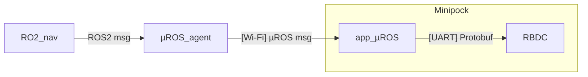
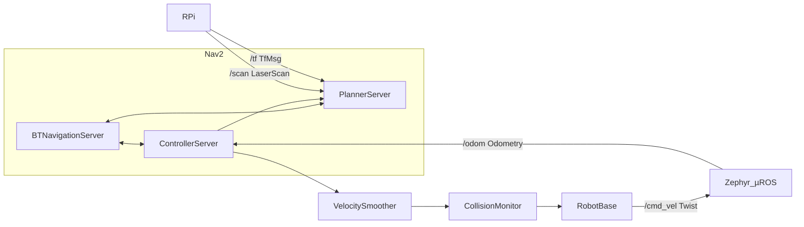

## Aperçu

Le système embarqué MiniPock est composé de deux parties :
- La stack applicative qui gère la navigation et communique avec la stack de controle moteur. Elle intègre micro-ROS pour la communication avec les nœuds ROS2 et est basée sur Zephyr OS.
- La stack de controle moteur permet déplacer le robot. Elle intègre le RBDC (Robot Base Driver Control) qui permet de demander un déplacement en x, y, theta.

## Architecture


## Interface

- La communication entre les nœuds ROS2 et la stack applicative utilise les topics ROS.
- La communication entre la stack applicative et le RBDC utilise les messages protobuf.



## Communication µROS - ROS2



### Liste des topics

| Topic        | Type        |
| ------------ | ----------- |
| /namespace/cmd_vel  | Twist       |
| /namespace/odom_raw | PoseStamped |
| /namespace/scan_raw | LaserScan   |

### Communication micro-ROS ↔RBDC | Protocol Buffer

```protobuf
syntax = "proto3";

message cmd_vel {
  float linear_x = 1;
  float linear_y = 2;
  float linear_z = 3;
  float angular_x = 4;
  float angular_y = 5;
  float angular_z = 6;
}

message odom {
  float x = 1;
  float y = 2;
  float theta = 3;
}
```
