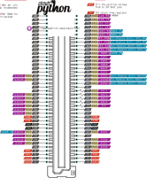

## Aperçu

L'electronique de la plateforme 6TRON est basée sur les cartes 6TRON.

## Stack applicative

La stack applicative est basée sur les cartes 6TRON suivantes :
- [Zest_Core_STM32H753ZI](https://6tron.io/zest_core/zest_core_stm32h753zi_2_0_0)
- [Zest_Test_Prototyping](https://6tron.io/zest/zest_test_prototyping_1_0_0)
- [Zest_Radio_WiFi](https://6tron.io/zest/zest_radio_wifi_1_0_0)

### Pinout

### LiDAR

#### Caractéristiques

Référence : LD19

#### Connection

| LiDAR | 6TRON   |
| ----- | ------- |
| TX    | DIO12   |
| PWM   | GND     |

### RBDC interface

La stack applicative communique avec le RBDC via une interface UART. Le protocol de communication est basé sur des messages protobuf.

### Connection

| RBDC | 6TRON   |
| ---- | ------- |
| TX   | UART_RX |
| RX   | UART_TX |

## Stack moteur

Cartes 6TRON :
- [Zest_Carrier_Extension](https://6tron.io/zest/zest_carrier_extension_1_0_0)
- [Zest_Core_STM32G474VET](https://6tron.io/zest/zest_core_stm32g474vet_1_0_0)
- [Zest_Actuator_HalfBridges](https://6tron.io/zest/zest_actuator_halfbridges_1_0_0)
- [Zest_Test_Prototyping](https://6tron.io/zest/zest_test_prototyping_1_0_0)

